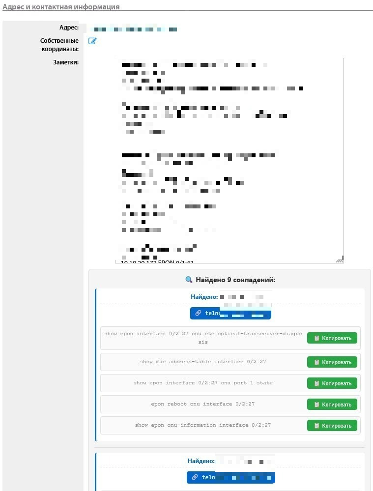

# Userside Improver
Userside web interface firefox improver

# Roadmap

- [ ] Add copy phone button to every phone
- [X] Add comment buttons with clipboard functionality
- [X] Add telnet and copy IP buttons